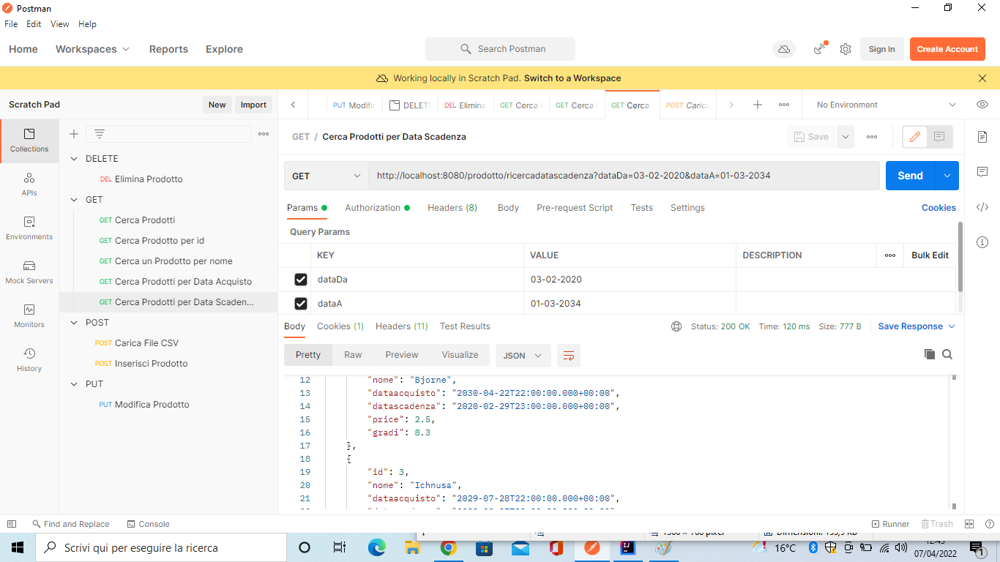
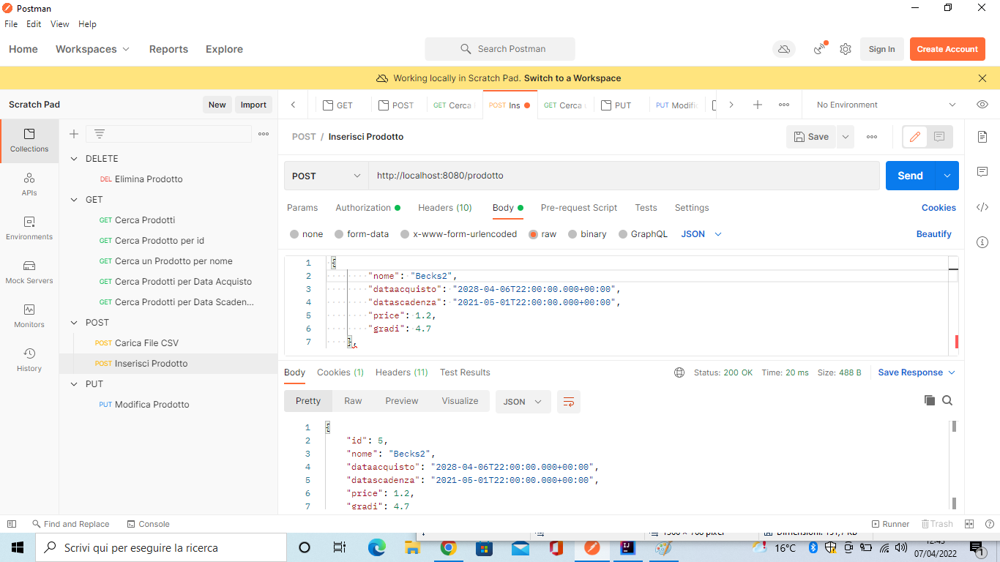

# EsercizioProdotto
Progetto corso

# GITHUB
https://github.com/Darioo98/EsercizioProdotto.git

| **METODO**           | **URL**                                             | **DESCRIZIONE**                       |
|----------------------|-----------------------------------------------------|---------------------------------------|
| **_DELETE_**         | _http://localhost:8080/prodotto/{id}_                 | Elimina prodotto                      |
| **_GET_**            | _http://localhost:8080/prodotti_                      | Cerca tutti i prodotti                |
| **_GET_**            | _http://localhost:8080/prodotto/{id}_                 | Cerca un prodotto per Id              |
| **_GET_**            | _http://localhost:8080/prodottoNome_                  | Cerca prodotto per nome               |
| **_GET_**            | _http://localhost:8080/prodotto/ricercadataaquisto_   | Cerca prodotto per data di acquisto   |
| **_GET_**            | _http://localhost:8080/prodotto/ricercadatascadenza_  | Cerca prodotto per data di Scadenza   |
| **_PUT_**            | _http://localhost:8080/prodotto/{id}_                 | Modifica prdotto in base all'id dato  |
| **_POST_**           | _http://localhost:8080/prodotto_                      | Inserisci prodotto                    |
| **_POST_**           | _http://localhost:8080/caricafile_                    | Carica file CSV                       |

